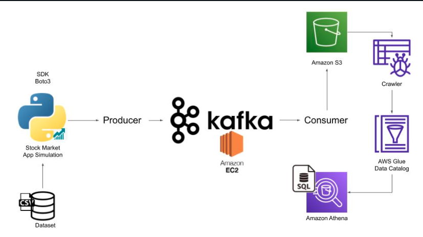

# Stock-Market-Real-Time-Data-Analysis-Using-Kafka

Executed an End-To-End Data Engineering Project on Real-Time Stock Market Data using Kafka.

Used different technologies such as Python, Amazon Web Services (AWS), Apache Kafka, Glue, Athena, and SQL.

Architecture

**All Credits to Darshil Parmar: https://www.youtube.com/watch?v=KerNf0NANMo&t=1826s**
